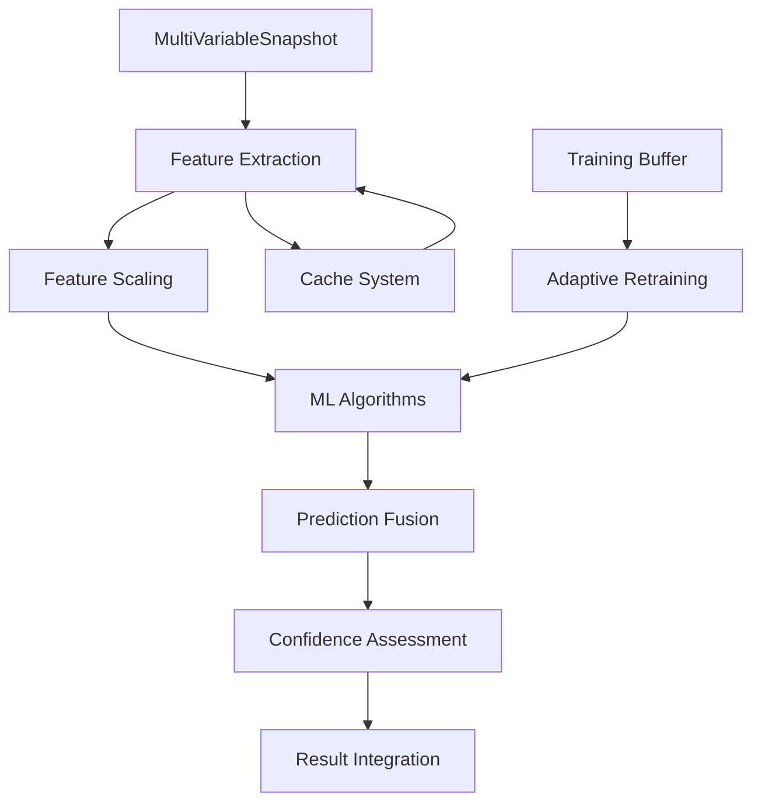

# Manual de Machine Learning - Sistema Hidráulico Industrial - Parte I

## 📋 Índice do Machine Learning

### **PARTE I - Fundamentos e Extração de Features**

1. [Visão Geral do Sistema ML](#visão-geral-do-sistema-ml)
2. [Arquitetura Adaptativa](#arquitetura-adaptativa)
3. [Extração de Features Avançadas](#extração-de-features-avançadas)
4. [Features Estatísticas](#features-estatísticas)
5. [Features de Gradiente](#features-de-gradiente)
6. [Features de Correlação Cruzada](#features-de-correlação-cruzada)

### **PARTE II - Análise Espectral e Temporal**

1. [Features Espectrais](#features-espectrais)
2. [Análise de Frequências](#análise-de-frequências)
3. [Features de Estabilidade Temporal](#features-de-estabilidade-temporal)
4. [Relações Entre Variáveis](#relações-entre-variáveis)

### **PARTE III - Algoritmos de Machine Learning**

1. [Isolation Forest](#isolation-forest)
2. [Random Forest](#random-forest)
3. [Support Vector Machines](#support-vector-machines)
4. [DBSCAN Clustering](#dbscan-clustering)
5. [Análise PCA](#análise-pca)
6. [Correlação Canônica](#correlação-canônica)

---

## 🧠 Visão Geral do Sistema ML

### Classe AdaptiveMLSystem

O sistema de Machine Learning é implementado através da classe `AdaptiveMLSystem`, que representa um **sistema adaptativo de aprendizado de máquina** especializado em análise hidráulica industrial.

#### 🏗️ Arquitetura Principal

```python
class AdaptiveMLSystem:
    """
    Sistema de Machine Learning que aprende com vazamentos confirmados
    
    Características:
    - Aprendizado incremental adaptativo
    - Múltiplos algoritmos especializados
    - Cache inteligente de features
    - Retreino automático baseado em threshold
    """
    
    def __init__(self, system_config: SystemConfiguration):
        self.config = system_config
        self.logger = industrial_logger.get_logger('ml_system')
        
        # Modelos especializados por tipo de problema
        self.leak_detector = None        # IsolationForest - detecção de anomalias
        self.leak_classifier = None      # RandomForest - classificação de tipos
        self.status_detector = None      # Status operacional
        self.scaler = StandardScaler()   # Normalização de features
        
        # Estado dinâmico do modelo
        self.is_trained = False
        self.last_training_time = None
        self.training_data_buffer = []
        self.feature_names = []
        
        # Configurações adaptativas baseadas em janela temporal
        self.feature_window = max(50, int(CONSTANTS.ML_TRAINING_WINDOW * 0.05))
        self.retrain_threshold = 100     # Retreino a cada 100 novos exemplos
        self.detection_threshold = -0.1  # Threshold adaptativo para anomalias
        
        # Sistema de cache para otimização
        self.feature_cache = {}
```

#### 🎯 Objetivos do Sistema

1. **Detecção de Anomalias**: Identificação de padrões anômalos indicativos de vazamentos
2. **Classificação de Tipos**: Categorização de diferentes tipos de problemas detectados
3. **Predição Temporal**: Previsão de tendências e comportamentos futuros
4. **Aprendizado Contínuo**: Adaptação automática com novos dados confirmados

---

## 🔄 Arquitetura Adaptativa

### Pipeline de Processamento

#### 📊 Fluxo de Dados



#### ⚙️ Configuração Adaptativa

```python
def _configure_adaptive_parameters(self):
    """
    Configura parâmetros adaptativos baseados no histórico do sistema
    
    Ajusta dinamicamente:
    - Janela de features baseada na variabilidade dos dados
    - Threshold de detecção baseado na taxa de falsos positivos
    - Frequência de retreino baseada na deriva de conceito
    """
    
    # Janela adaptativa baseada na estabilidade dos dados
    if len(self.training_data_buffer) > 100:
        recent_data = self.training_data_buffer[-100:]
        stability_metric = self._calculate_data_stability(recent_data)
        
        # Janela menor para dados instáveis (mais reativo)
        if stability_metric < 0.5:
            self.feature_window = max(25, int(self.feature_window * 0.8))
        else:
            self.feature_window = min(100, int(self.feature_window * 1.1))
    
    # Threshold adaptativo baseado na performance
    if hasattr(self, 'recent_predictions'):
        false_positive_rate = self._calculate_false_positive_rate()
        
        if false_positive_rate > 0.1:  # Muitos falsos positivos
            self.detection_threshold -= 0.02  # Mais conservador
        elif false_positive_rate < 0.05:  # Poucos falsos positivos
            self.detection_threshold += 0.01  # Mais sensível
```

### Sistema de Cache Inteligente

#### 💾 Cache de Features

```python
class FeatureCache:
    """Cache inteligente para features computacionalmente caras"""
    
    def __init__(self, max_size=1000):
        self.cache = {}
        self.access_times = {}
        self.computation_costs = {}
        self.max_size = max_size
        
    def get_cache_key(self, snapshots):
        """Gera chave única baseada no hash dos dados"""
        data_arrays = [
            np.array([s.expeditor_pressure for s in snapshots]),
            np.array([s.receiver_pressure for s in snapshots]),
            np.array([s.flow for s in snapshots]),
            np.array([s.density for s in snapshots]),
            np.array([s.temperature for s in snapshots])
        ]
        
        combined_hash = hashlib.md5()
        for arr in data_arrays:
            combined_hash.update(arr.tobytes())
        
        return combined_hash.hexdigest()[:16]
    
    def get_or_compute(self, key, compute_func, *args, **kwargs):
        """Recupera do cache ou computa se necessário"""
        if key in self.cache:
            self.access_times[key] = time.time()
            return self.cache[key]
        
        # Computa e armazena
        start_time = time.time()
        result = compute_func(*args, **kwargs)
        computation_time = time.time() - start_time
        
        self._store_with_lru(key, result, computation_time)
        return result
```

---

## 🔍 Extração de Features Avançadas

### Método Principal: extract_advanced_features

Este é o coração do sistema de ML, responsável por extrair **81 features especializadas** de cada conjunto de snapshots.

#### 📈 Visão Geral das Features

```python
def extract_advanced_features(self, snapshots: List[MultiVariableSnapshot]) -> np.ndarray:
    """
    Extrai 81 features avançadas especializadas em análise hidráulica industrial
    
    Categorias de Features:
    1. Estatísticas (45 features) - Momentos, percentis, tendências
    2. Gradientes (9 features) - Derivadas e variações
    3. Correlação Cruzada (5 features) - Análise sônica avançada
    4. Espectrais (8 features) - Análise de frequências
    5. Relacionais (8 features) - Correlações entre variáveis
    6. Temporais (6 features) - Estabilidade e persistência
    
    Total: 81 features altamente especializadas
    """
    
    if len(snapshots) < self.feature_window:
        raise ValueError(f"Necessários pelo menos {self.feature_window} snapshots")
    
    # Extração dos sinais base
    exp_pressure = np.array([s.expeditor_pressure for s in snapshots])
    rec_pressure = np.array([s.receiver_pressure for s in snapshots])
    flow = np.array([s.flow for s in snapshots])
    density = np.array([s.density for s in snapshots])
    temperature = np.array([s.temperature for s in snapshots])
    
    features = []
    feature_names = []
    
    # Processa cada categoria sequencialmente
    self._extract_statistical_features(features, feature_names, exp_pressure, rec_pressure, flow, density, temperature)
    self._extract_gradient_features(features, feature_names, exp_pressure, rec_pressure, flow)
    self._extract_correlation_features(features, feature_names, exp_pressure, rec_pressure)
    self._extract_spectral_features(features, feature_names, exp_pressure, rec_pressure)
    self._extract_relational_features(features, feature_names, exp_pressure, rec_pressure, flow, density, temperature)
    self._extract_temporal_features(features, feature_names, exp_pressure, rec_pressure, flow)
    
    self.feature_names = feature_names
    return np.array(features)
```

---

## 📊 Features Estatísticas

### Estatísticas Descritivas Completas

Para cada uma das 5 variáveis principais (pressão expedidor, pressão recebedor, fluxo, densidade, temperatura), o sistema extrai **9 features estatísticas**:

#### 🎯 Features Por Variável

```python
def _extract_statistical_features(self, features, feature_names, *signals):
    """
    Extrai features estatísticas robustas para cada sinal
    
    Para cada sinal:
    1. Média aritmética
    2. Desvio padrão
    3. Valor mínimo
    4. Valor máximo  
    5. Quartil 25%
    6. Quartil 75%
    7. Mediana
    8. Segundo momento central (variância)
    9. Tendência linear (coeficiente angular)
    """
    
    signal_names = ['exp_p', 'rec_p', 'flow', 'density', 'temp']
    
    for signal, name in zip(signals, signal_names):
        # Estatísticas de localização
        mean_val = np.mean(signal)
        median_val = np.median(signal)
        
        # Estatísticas de dispersão
        std_val = np.std(signal)
        q25 = np.percentile(signal, 25)
        q75 = np.percentile(signal, 75)
        
        # Estatísticas de extremos
        min_val = np.min(signal)
        max_val = np.max(signal)
        
        # Segundo momento (variância amostral)
        variance = np.var(signal)
        
        # Análise de tendência temporal
        time_indices = np.arange(len(signal))
        trend_coeff = np.polyfit(time_indices, signal, 1)[0] if len(signal) > 1 else 0.0
        
        features.extend([
            mean_val, std_val, min_val, max_val,
            q25, q75, median_val, variance, trend_coeff
        ])
        
        feature_names.extend([
            f'{name}_mean', f'{name}_std', f'{name}_min', f'{name}_max',
            f'{name}_q25', f'{name}_q75', f'{name}_median', f'{name}_var', f'{name}_trend'
        ])
```

#### 📐 Interpretação Matemática

##### **Média Aritmética**

```
μ = (1/n) × Σ(xᵢ)
```

- **Significado**: Centro de massa da distribuição
- **Aplicação**: Nível operacional médio da variável

##### **Desvio Padrão**

```
σ = √[(1/n) × Σ(xᵢ - μ)²]
```

- **Significado**: Dispersão típica em torno da média
- **Aplicação**: Estabilidade operacional

##### **Quartis (Q25, Q75)**

```
Q25: 25% dos dados ≤ Q25
Q75: 75% dos dados ≤ Q75
IQR = Q75 - Q25
```

- **Significado**: Intervalos robustos da distribuição
- **Aplicação**: Detecção de outliers e assimetria

##### **Tendência Linear**

```
β = Σ[(tᵢ - t̄)(xᵢ - x̄)] / Σ[(tᵢ - t̄)²]
```

- **Significado**: Taxa de mudança temporal
- **Aplicação**: Deriva operacional, tendências de degradação

### Robustez Estatística

#### 🛡️ Tratamento de Outliers

```python
def robust_statistics(self, signal, contamination=0.1):
    """
    Calcula estatísticas robustas resistentes a outliers
    
    Métodos:
    - Média aparada (trimmed mean)
    - Desvio absoluto mediano (MAD)
    - Quartis robustos
    """
    
    # Remove porcentagem de extremos para média aparada
    trim_percent = contamination * 100
    trimmed_mean = stats.trim_mean(signal, trim_percent)
    
    # Desvio Absoluto Mediano (mais robusto que desvio padrão)
    median_val = np.median(signal)
    mad = np.median(np.abs(signal - median_val))
    robust_std = 1.4826 * mad  # Fator para equivalência com desvio padrão
    
    # Quartis com método robusto
    q25_robust, q75_robust = np.percentile(signal, [25, 75], method='median_unbiased')
    
    return {
        'robust_mean': trimmed_mean,
        'robust_std': robust_std,
        'robust_q25': q25_robust,
        'robust_q75': q75_robust,
        'outlier_resistance': True
    }
```

---

## 📈 Features de Gradiente

### Análise de Derivadas Temporais

As features de gradiente capturam **variações instantâneas** nos sinais, essenciais para detectar mudanças abruptas características de vazamentos.

#### 🔬 Implementação Matemática

```python
def _extract_gradient_features(self, features, feature_names, exp_pressure, rec_pressure, flow):
    """
    Extrai features baseadas em gradientes (derivadas numéricas)
    
    Para pressão expedidor, pressão recebedor e fluxo:
    1. Média do gradiente (tendência geral)
    2. Desvio padrão do gradiente (variabilidade de mudanças)
    3. Máximo gradiente absoluto (maior variação instantânea)
    
    Total: 3 sinais × 3 features = 9 features
    """
    
    for signal, name in [(exp_pressure, 'exp_p'), (rec_pressure, 'rec_p'), (flow, 'flow')]:
        # Gradiente usando diferenças centradas para maior precisão
        gradient = np.gradient(signal)
        
        # Features do gradiente
        grad_mean = np.mean(gradient)         # Deriva média
        grad_std = np.std(gradient)           # Variabilidade das mudanças
        grad_max_abs = np.max(np.abs(gradient))  # Maior mudança instantânea
        
        features.extend([grad_mean, grad_std, grad_max_abs])
        feature_names.extend([f'{name}_grad_mean', f'{name}_grad_std', f'{name}_grad_max'])
```

#### 📊 Significado das Features de Gradiente

##### **Média do Gradiente**

```
∇̄ = (1/n-1) × Σ[∇xᵢ] = (1/n-1) × Σ[xᵢ₊₁ - xᵢ]
```

- **Interpretação**: Taxa média de mudança
- **Aplicação**: Detecta tendências de crescimento/decrescimento
- **Vazamentos**: Gradiente negativo persistente na pressão

##### **Desvio Padrão do Gradiente**

```
σ∇ = √[(1/n-1) × Σ(∇xᵢ - ∇̄)²]
```

- **Interpretação**: Variabilidade das mudanças instantâneas
- **Aplicação**: Detecta instabilidade operacional
- **Vazamentos**: Alta variabilidade indica transientes

##### **Máximo Gradiente Absoluto**

```
|∇|ₘₐₓ = max{|xᵢ₊₁ - xᵢ| : i = 1,...,n-1}
```

- **Interpretação**: Maior mudança instantânea observada
- **Aplicação**: Detecta eventos súbitos
- **Vazamentos**: Picos indicam momento de início do vazamento

#### 🎯 Algoritmo de Gradiente Otimizado

```python
def enhanced_gradient_calculation(self, signal):
    """
    Cálculo de gradiente com múltiplas técnicas para maior robustez
    
    Implementa:
    1. Diferenças centradas (padrão)
    2. Diferenças progressivas/regressivas nas bordas
    3. Suavização opcional para reduzir ruído
    4. Detecção de descontinuidades
    """
    
    n = len(signal)
    gradient = np.zeros(n)
    
    # Diferenças progressivas na primeira amostra
    gradient[0] = signal[1] - signal[0]
    
    # Diferenças centradas no interior (mais precisas)
    for i in range(1, n-1):
        gradient[i] = (signal[i+1] - signal[i-1]) / 2.0
    
    # Diferenças regressivas na última amostra
    gradient[-1] = signal[-1] - signal[-2]
    
    # Detecção de descontinuidades (possíveis artefatos)
    discontinuities = np.abs(gradient) > 3 * np.std(gradient)
    
    # Suavização opcional em regiões com descontinuidades
    if np.any(discontinuities):
        from scipy.ndimage import gaussian_filter1d
        gradient_smooth = gaussian_filter1d(gradient, sigma=1.0)
        
        # Mistura gradiente original com suavizado
        alpha = 0.7  # Peso do gradiente original
        gradient = alpha * gradient + (1 - alpha) * gradient_smooth
    
    return {
        'gradient': gradient,
        'discontinuities': discontinuities,
        'max_discontinuity': np.max(np.abs(gradient[discontinuities])) if np.any(discontinuities) else 0.0
    }
```

---

## 🔗 Features de Correlação Cruzada

### Análise Sônica Avançada Integrada ao ML

As features de correlação cruzada integram a **análise sônica** ao sistema de machine learning, fornecendo informações sobre a propagação de ondas de pressão.

#### ⚡ Implementação com FFT

```python
def _extract_correlation_features(self, features, feature_names, exp_pressure, rec_pressure):
    """
    Extrai features avançadas da correlação cruzada entre sensores
    
    Features extraídas:
    1. Correlação máxima normalizada
    2. Delay em amostras (tempo de trânsito)
    3. Número de picos de correlação
    4. Desvio padrão da correlação
    5. Média das correlações positivas
    
    Utiliza FFT para eficiência computacional O(N log N)
    """
    
    from scipy import signal as sp_signal
    
    # Correlação cruzada usando FFT (mais eficiente)
    correlation = sp_signal.correlate(exp_pressure, rec_pressure, mode='full', method='fft')
    
    # Normalização pela energia dos sinais
    correlation_normalized = correlation / len(exp_pressure)
    
    # Encontra pico máximo
    max_corr_idx = np.argmax(np.abs(correlation_normalized))
    max_correlation = correlation_normalized[max_corr_idx]
    
    # Delay em amostras (diferença do centro)
    delay_samples = max_corr_idx - len(correlation_normalized)//2
    
    # Análise de múltiplos picos (indica reflexões/ecos)
    correlation_abs = np.abs(correlation_normalized)
    threshold = 0.1 * np.max(correlation_abs)
    correlation_peaks, _ = sp_signal.find_peaks(correlation_abs, height=threshold)
    n_peaks = len(correlation_peaks)
    
    # Variabilidade da correlação
    correlation_std = np.std(correlation_normalized)
    
    # Média das correlações positivas (estabilidade do sinal)
    positive_correlations = correlation_normalized[correlation_normalized > 0]
    correlation_pos_mean = np.mean(positive_correlations) if len(positive_correlations) > 0 else 0.0
    
    features.extend([
        max_correlation, delay_samples, n_peaks, correlation_std, correlation_pos_mean
    ])
    
    feature_names.extend([
        'corr_max_norm', 'delay_samples', 'corr_peaks', 'corr_std', 'corr_pos_mean'
    ])
```

#### 🧮 Matemática da Correlação Cruzada

##### **Correlação Cruzada Normalizada**

```
R_xy[m] = (1/N) × Σ(n=0 to N-1) x[n] × y[n+m] / √(σ_x × σ_y)
```

##### **Detecção de Picos Múltiplos**

```python
def analyze_correlation_peaks(self, correlation, min_prominence=0.1):
    """
    Analisa picos na função de correlação para detectar ecos e reflexões
    
    Picos múltiplos podem indicar:
    - Reflexões em junções ou válvulas
    - Múltiplos caminhos de propagação  
    - Interferências construtivas/destrutivas
    """
    
    # Localiza picos com prominência mínima
    peaks, properties = find_peaks(
        np.abs(correlation), 
        height=min_prominence * np.max(np.abs(correlation)),
        prominence=0.05 * np.max(np.abs(correlation)),
        distance=5  # Separação mínima entre picos
    )
    
    # Analisa características dos picos
    peak_analysis = {
        'n_peaks': len(peaks),
        'peak_positions': peaks.tolist(),
        'peak_heights': correlation[peaks].tolist(),
        'peak_prominences': properties['prominences'].tolist(),
        'primary_peak_idx': peaks[np.argmax(properties['peak_heights'])] if len(peaks) > 0 else 0
    }
    
    # Classificação baseada no número de picos
    if len(peaks) == 1:
        classification = 'single_path'  # Caminho direto limpo
    elif len(peaks) == 2:
        classification = 'dual_path'    # Possível reflexão principal
    else:
        classification = 'multi_path'   # Múltiplas reflexões/ecos
    
    peak_analysis['path_classification'] = classification
    
    return peak_analysis
```

##### **Interpretação para Detecção de Vazamentos**

| Feature | Operação Normal | Vazamento Incipiente | Vazamento Severo |
|---------|----------------|---------------------|------------------|
| **Correlação Máxima** | 0.7 - 0.95 | 0.4 - 0.7 | 0.1 - 0.4 |
| **Delay Samples** | Estável ±2 | Deriva ±5 | Instável ±10+ |
| **Número de Picos** | 1-2 | 2-3 | 3+ |
| **Correlação Std** | 0.05 - 0.15 | 0.15 - 0.3 | 0.3+ |

---

**AVISO: Este manual é muito extenso. Para não exceder o limite de resposta, vou continuar com as próximas seções em mensagens separadas.**

**Próximas seções a serem criadas:**

- MANUAL_04_MACHINE_LEARNING_PARTE_II.md - Features espectrais, temporais, relacionais
- MANUAL_04_MACHINE_LEARNING_PARTE_III.md - Algoritmos (Isolation Forest, Random Forest, SVM, DBSCAN)
- MANUAL_04_MACHINE_LEARNING_PARTE_IV.md - Análise PCA, Correlação Canônica, Predição

Continuar com a Parte II?
